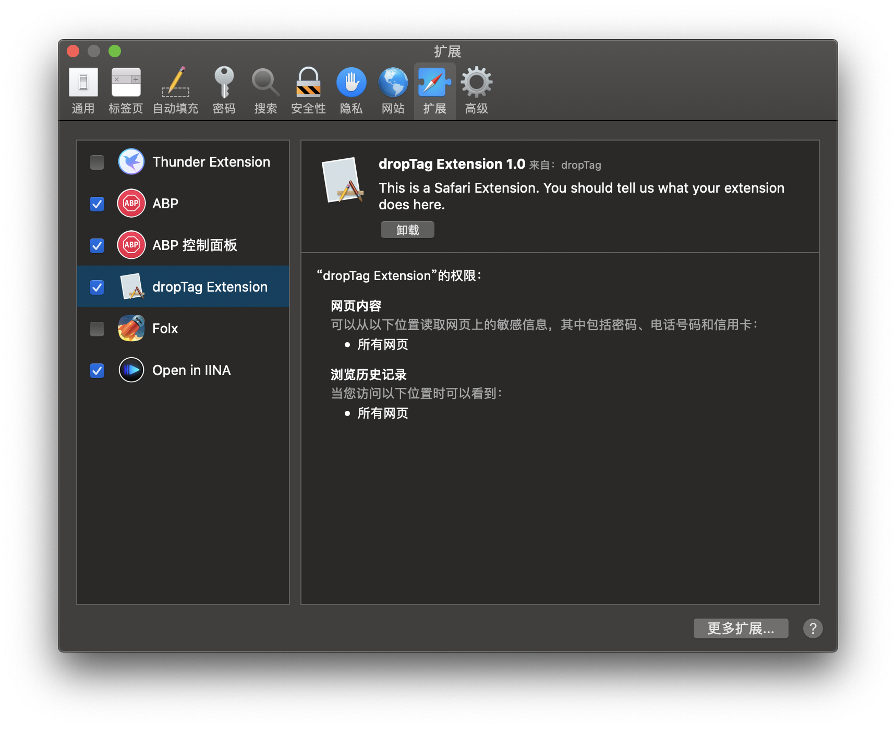

# drag and go for safari

`chrome`上[超级拖拽](https://chrome.google.com/webstore/detail/drag-and-go/jaikcnhlohebodlpkmjepipngegjbfpg) 的`safari`版本，去掉了手势的操作，简化了打开标签的方式：
- 后台打开标签链接往上拖
- 直接打开往下拖  
需要在safari中启用`允许未签名的扩展`。
然后启用扩展：

